# DBIM-AI 智能客服系统 (LiveChat + Dify) 
## 🌟 系统概述

DBIM-AI 智能客服 结合 LiveChat 的实时沟通能力与 Dify 的 AI 处理引擎，构建了一个智能高效的客户服务解决方案。系统能够自动理解客户问题，处理常见查询并减轻客服工作量，确保客户获得即时准确的回答。并在必要时无缝转接人工客服。

## 🧩 商业版/免费版

使用内置积分 免费版可升级商业版，商业版无功能限制，后台可设置自定义升级所需积分消耗和版本说明。

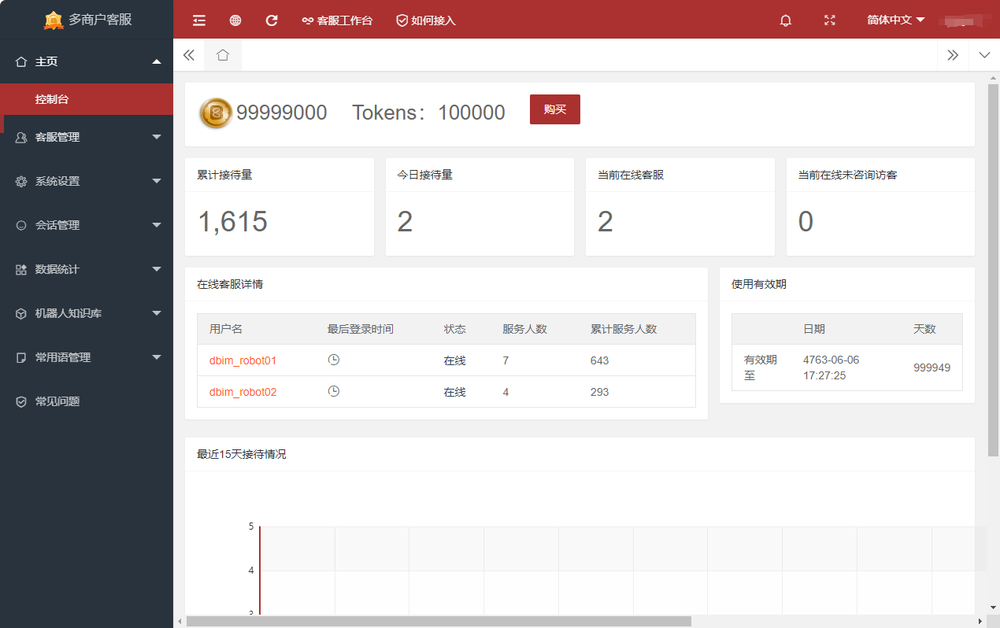


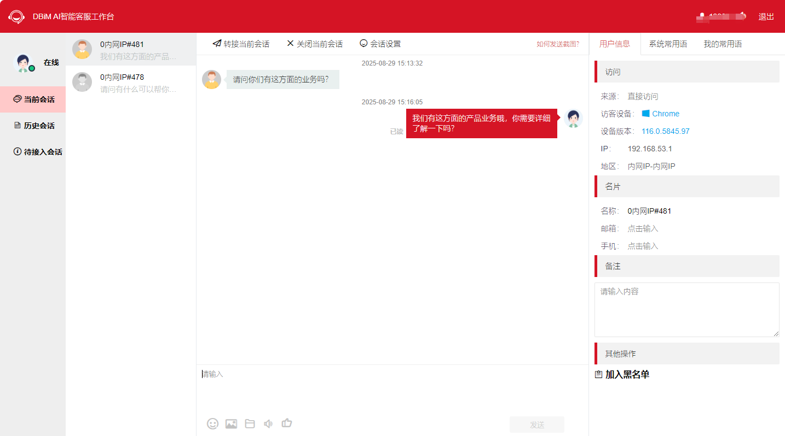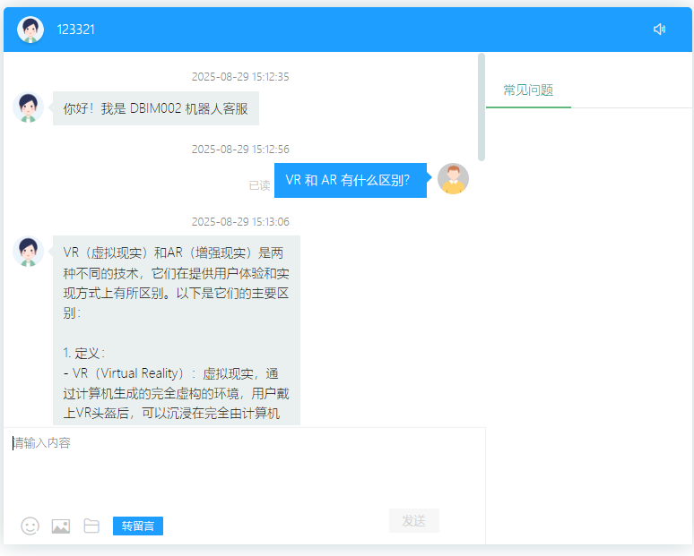


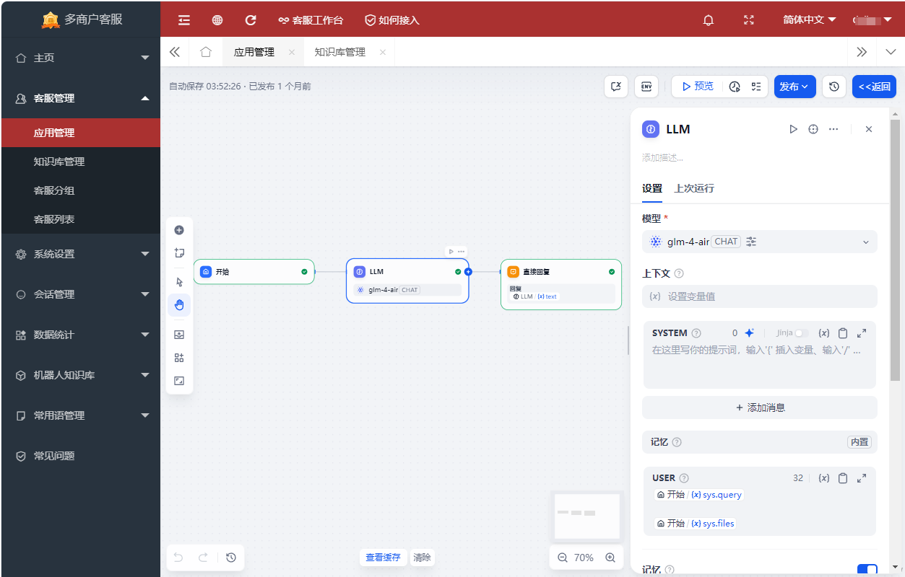

### 💬 全渠道支持台

DBIM-AI 智能客服 将所有客户对话集中到一个强大的 Bot Server服务中，支持 用户自定义客服名称、头像、检索回复关键词等所有自定义属性。它支持在您的Web网站、wap移动端、APP移动端等多种方式引入客服聊天对话框、自定义聊天对话框、API服务调用等进行实时聊天。

### 📚 接入中心指南

通过系统提供的 接入指南 文档，指导用户在不同使用场景 轻松接入DBIM-AI智能客服，让客服在不同使用场景，更便捷的得到智能客服的咨询帮助服务。

## 📋 核心功能与技术架构

| 功能模块             | 功能描述                                                     | 依赖组件        |
| -------------------- | ------------------------------------------------------------ | --------------- |
| 实时聊天交互         | 支持文字、图片、文件传输，客户无需下载 APP 即可通过网页 / API发起咨询 | LiveChat        |
| AI 智能应答          | 基于 企业知识库+联网搜索 自动回答常见问题，支持多轮对话      | Dify + 知识库   |
| 转接人工客服无缝衔接 | AI客服 无法获取到精准解答时，用户可选择转接人工客服，人工客服将为用户提供更好的服务和精准的回答 | LiveChat + Dify |
| 客户意图识别         | 自动识别客户咨询意图（如 “产品详细”，“使用说明书”等），AI 客服 自动检索知识库 + 联网搜索 + LLM 组织解答话术 | Dify + LLM      |
| 多渠道统一管理       | 整合网页、APP、WAP等渠道咨询，统一在 LiveChat 后台处理       | LiveChat        |
| 数据分析与报表       | 输出咨询量、AI 解决率、客户满意度等数据报表，支持周 / 月维度导出 | Dify 数据分析   |

## 🛠 安装部署

前置要求：

​	1、docker 容器

​	2、postgresql 数据库

​	3、mysql 数据库

​	4、堡塔（便于管理、部署及环境安装）

​	5、php-7.2.33 及 php扩展：1、pgsql，2、pdo_pgsql 

部署步骤：

​	1、安装 PostgreSQL 及 uuid-ossp 组件

		# 1、安装 psql:
		# 更新安装包列表	
		sudo apt update
		
		# 安装 PostgreSQL 及 附加组件库（包含 uuid-ossp）
		sudo apt install postgresql postgresql-contrib postgresql-client
		
		# 检查服务状态
		sudo systemctl status postgresql
		
		# 查看postgresql版本
		sudo -u postgres psql -c "SELECT version();"
		
		# 列出所有可用扩展
		sudo -u postgres psql -c "SELECT * FROM pg_available_extensions WHERE name='uuid-ossp';"
		
		# 2、启动并检查服务状态：
		# 启动服务
		sudo systemctl start postgresql
		
		# 设置开机启动
		sudo systemctl enable postgresql
		
		# 检查状态
		sudo systemctl status postgresql
		
		# 3、安装 uuid-ossp 扩展：
		# 切换到 postgres 用户
		sudo -i -u postgres
		
		# 进入 PostgreSQL 交互终端
		psql
		
		# 4、测试调用 uuid-ossp 扩展组件：
		# 创建扩展
		CREATE EXTENSION IF NOT EXISTS "uuid-ossp";
		
		# 验证安装，测试生成UUID
		SELECT uuid_generate_v4();
		
		# 5、如何设置 PostgreSQL 初始密码
		# 修改 postgres 用户密码
		ALTER USER postgres WITH PASSWORD '你的密码';
		
		# 然后编辑配置文件 /etc/postgresql/[pgsql版本号]/main/pg_hba.conf，将认证方式改为 md5
		# 将 local 行的 peer 改为 md5
		local  all  postgres    md5
		
		# 6、开启 PostgreSQL 远程连接
		# 打开 /etc/postgresql/[pgsql版本号]/main/postgresql.conf
		# 将 listen_addresses = 'localhost' 
		# 修改为 
		# listen_addresses = '*' # 允许所有IP连接 或 指定 IP连接
		
		# 7、修改客户端认证配置
		# 打开 /etc/postgresql/[pgsql版本号]/main/pg_hba.conf
		# 在文件末尾添加：
		host  all  all  0.0.0.0/0  md5
		
		# 8、重启服务生效
		sudo systemctl restart postgresql
		

​	2、安装 Dify

	# 进入 Dify 源码的 Docker 目录
	cd dify/docker
	
	# 赋值环境配置文件
	cp .env.example .env
	
	# 启动 Docker 容器
		# 如果版本是 Docker Compose V2，使用以下命令：
		sudo docker compose up -d 
		
		# 如果版本是 docker Compose V1，使用以下命令：
		sudo docker-compose up -d 
		
		# 运行命令后，你会看到类似以下的输出，显示所有容器的状态和端口映射：
	  	✔ Network docker_ssrf_proxy_network  Created     0.0s 
	  	✔ Container dbim_dify_plugin_daemon  Started     0.5s 
	  	✔ Container dbim_dify_web            Started     0.4s 
	  	✔ Container dbim_dify_ssrf_proxy     Started     0.4s 
	  	⠼ Container dbim_dify_redis          Starting    0.5s 
	  	✔ Container dbim_dify_weaviate       Started     0.4s 
	  	✔ Container dbim_dify_sandbox        Started     0.4s 
	  	✔ Container dbim_dify_worker         Created     0.0s 
	  	✔ Container dbim_dify_API            Created     0.0s 
	  	✔ Container dbim_dify_nginx          Created     0.0s 
	  	
	 
	# 最后检查是否所有容器都正常运行：
	docker compose ps
	

​	3、访问dify

```
	# 你可以先前往管理初始化设置页面，设置管理员账户：
	# 此管理员账户拥有 dify 系统所有最高权限功能
	
	# 本地环境访问地址：
	http://localhost/install
	
	# 服务器环境访问地址：
	http://your_server_ip/install
	
```

​	4、Docker 镜像拉取不成功：

```
# 由于网络原因，docker镜像拉去不成功的概率比较大，这里就不做过多解释，直接在系统配置以下镜像源，拉取镜像成功的概率比较大，镜像源如下：

"https://docker.1ms.run",
"https://hub.rat.dev",
"https://docker.1panel.live",
"https://hub.rat.dev",
"https://proxy.1panel.live",
"https://ghcr.nju.edu.cn",
"https://docker.registry.cyou",
"https://dockercf.jsdelivr.fyi",
"https://docker.rainbond.cc",
"https://registry.cn-shenzhen.aliyuncs.com",
"https://dockertest.jsdelivr.fyi",
"https://mirror.aliyuncs.com",
"https://mirror.baidubce.com",
"https://docker.mirrors.ustc.edu.cn",
"https://docker.mirrors.sjtug.sjtu.edu.cn",
"https://mirror.iscas.ac.cn",
"https://docker.nju.edu.cn",
"https://docker.m.daocloud.io",
"https://dockerproxy.com",
"https://docker.jsdelivr.fyi",
"https://docker-cf.registry.cyou"
```

​	5、系统常用配置命令

```
# 系统常用配置命令：

# 重载配置
sudo systemctl daemon-reload  

# 重启服务 
sudo systemctl restart docker 

# 移除旧的 docker 配置（移除所有 docker 镜像）
docker-compose down 

# 启动所有 dify 配置的镜像
docker-compose up -d 

# 停止但不删除
docker-compose stop <service_name>  

# 删除已停止的容器
docker-compose rm <service_name>    

# 重新构建 web 项目
docker-compose build web 

```

​	6、安装 php-7.2.33 及 相关扩展

```
# 注意要安装 php-7.2.33 的扩展，删除其他版本的php，否则 pgsql 驱动会报找不到 驱动：
# 扩展-1：pgsql （需提前安装 postgresql 数据库）
# 扩展-2：pdo-pgsql (需提前安装 postgresql)
```

​	7、文件部署

```
# 部署完成 Dify 之后，将 livechat 项目中的： 
# dbim.livechat\application\seller\view\index\difylogin.html 
# 文件 复制到 docker 容器名称为：dbim_dify_web 
# 目录：app\web\public 目录下
# 完成以上操作之后，需要重启 dbim_dify_web 容器，重启后 文件才能被加载生效
```

​	8、防火墙设置

```
# 堡塔防火墙 配置 开放 5432 或 当前堡塔 pgsql 数据库使用的端口

```

​	9、LiveChat 项目搭建

```
# 把源码上传，放到/www/wwwroot 目录下
# 建议您 通过命令：
chow -R www:www ./AiService
# --设置文件的 所属以及分组为 WWW，以避免权限问题。

# 添加网站
# 在堡塔 网站目录 - PHP项目 - 添加php站点，将livechat 创建为 php 站点
```

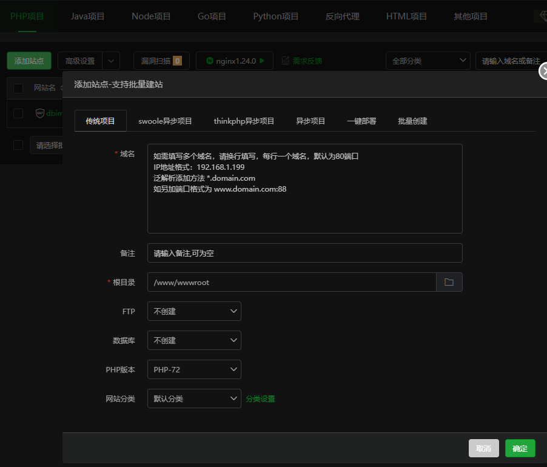

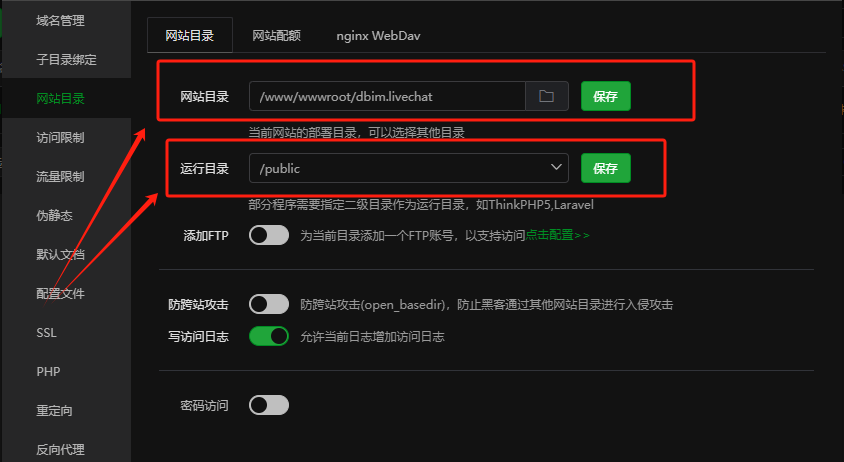

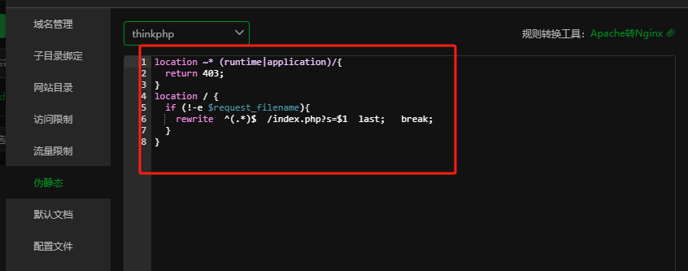

​	10、数据库配置

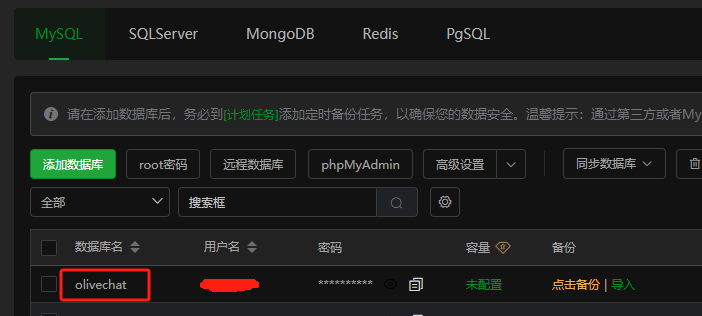

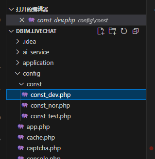

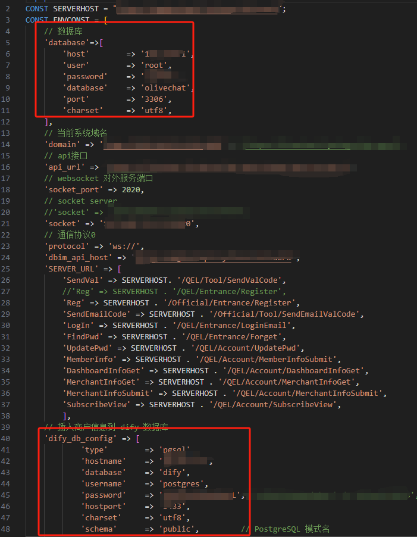

​	11、启动 gatewayworker

```
# 启动 gatewayworker
php start.php start

# 这几段是 debug 模式 其他命令：
# debug执行
php start.php start

# 守护进程执行
php start.php start -d

# 重启守护进程执行
php start.php retart -d

# 停止执行
php start.php stop
```

​	12、LiveChat 项目配置

```
# 配置完成后，站点入口：
# 官网：http://yourservice_IP:端口/
# DBIM AI智能客服系统（商家端）:http://yourservice_IP:端口/seller/login/index.html
# 客服系统管理后台：http://yourservice_IP:端口/admin/login/index.html
# DBIM AI智能客服工作台：http://yourservice_IP:端口/service/login/index
```

​	13、系统配置

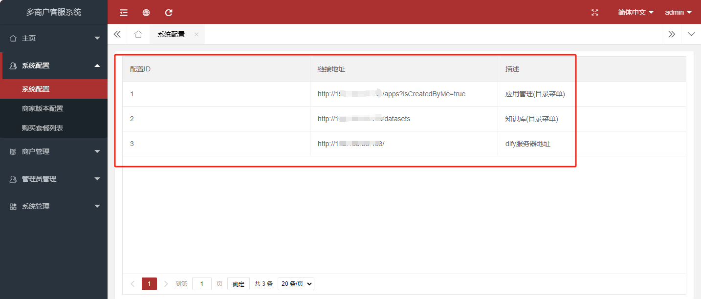

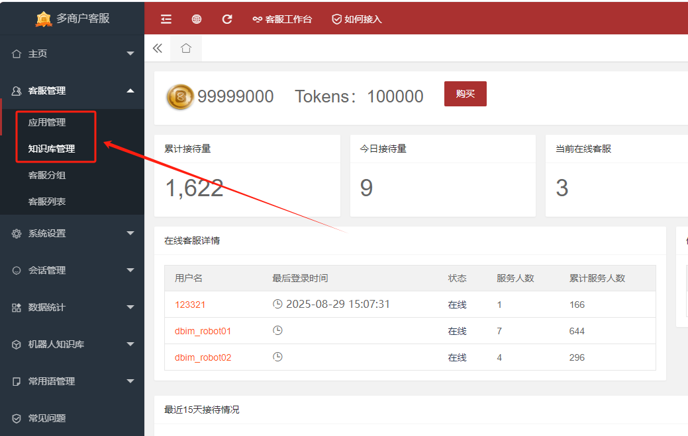

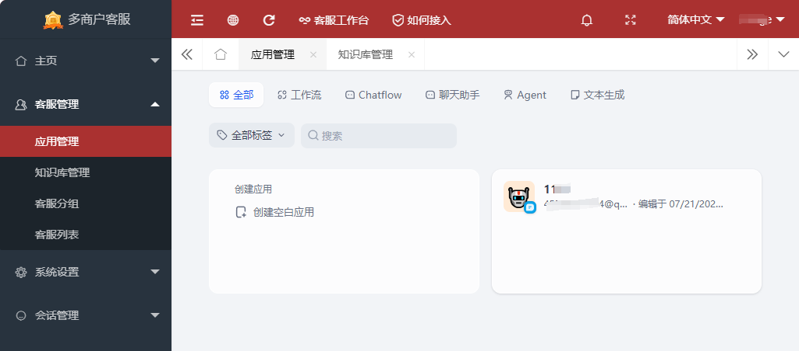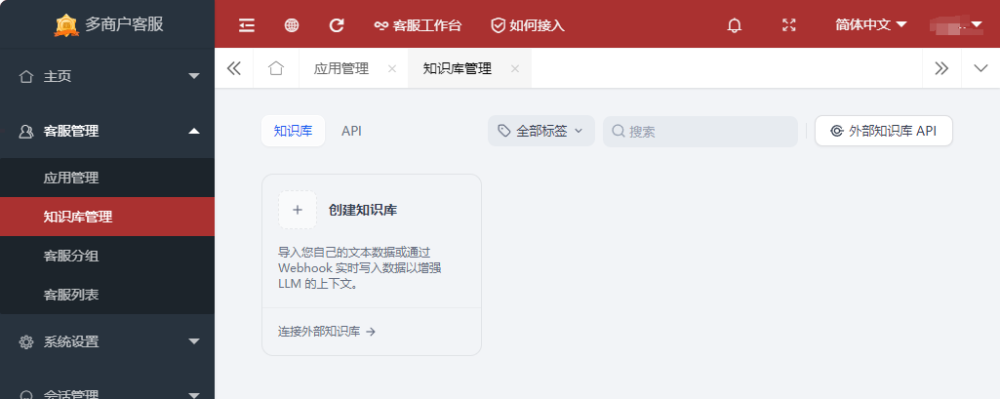


